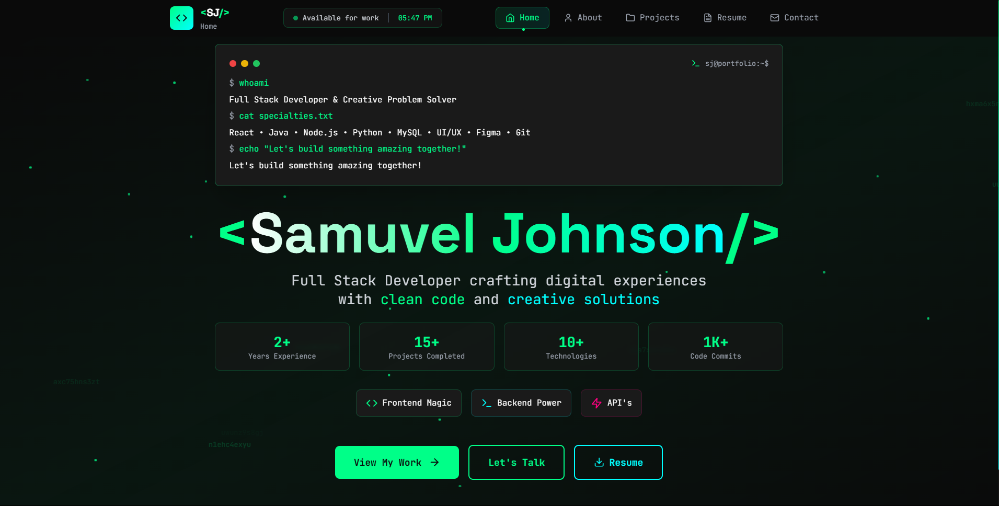

# 🚀 Portfolio Website - Samuvel Johnson

A modern, responsive portfolio website built with React, TypeScript, and Tailwind CSS. Features smooth animations, dark/light theme switching, and a functional contact form.



## ✨ Features

- **Modern Design**: Clean, professional interface with neon-themed styling
- **Responsive Layout**: Optimized for all device sizes and screen resolutions
- **Smooth Animations**: Powered by Framer Motion for engaging user experience
- **Theme Switching**: Dark and light mode support with system preference detection
- **Contact Form**: Functional email integration using EmailJS
- **Project Showcase**: Interactive project gallery with filtering capabilities
- **Resume Section**: Comprehensive professional experience and skills display
- **SEO Optimized**: Proper meta tags and structured data

## 🛠️ Tech Stack

- **Frontend**: React 18 + TypeScript
- **Styling**: Tailwind CSS with custom neon theme
- **Animations**: Framer Motion
- **Icons**: Lucide React
- **Email Service**: EmailJS
- **Build Tool**: Vite
- **Deployment**: Vercel

## 🚀 Quick Start

### Prerequisites

- Node.js (v16 or higher)
- npm or yarn

### Installation

1. **Clone the repository**
   ```bash
   git clone https://github.com/samuveljohnson1416/new_portfolio.git
   cd new_portfolio
   ```

2. **Install dependencies**
   ```bash
   npm install
   ```

3. **Set up environment variables**
   ```bash
   cp .env.example .env.local
   ```
   
   Then edit `.env.local` and add your EmailJS credentials:
   ```env
   VITE_EMAILJS_SERVICE_ID=your_service_id_here
   VITE_EMAILJS_TEMPLATE_ID=your_template_id_here
   VITE_EMAILJS_PUBLIC_KEY=your_public_key_here
   ```

4. **Start development server**
   ```bash
   npm run dev
   ```

5. **Open your browser** and navigate to `http://localhost:5173`

## 📧 EmailJS Setup

To enable the contact form functionality:

1. Create an account at [EmailJS](https://www.emailjs.com/)
2. Create an email service (Gmail, Outlook, etc.)
3. Create an email template with the following variables:
   - `{{from_name}}` - Sender's name
   - `{{from_email}}` - Sender's email
   - `{{message}}` - Message content
4. Get your Service ID, Template ID, and Public Key
5. Add them to your `.env.local` file

## 🏗️ Project Structure

```
src/
├── components/          # React components
│   ├── About.tsx       # About section
│   ├── Contact.tsx     # Contact form
│   ├── Home.tsx        # Hero section
│   ├── Navigation.tsx  # Navigation bar
│   ├── Projects.tsx    # Projects showcase
│   └── Resume.tsx      # Resume/CV section
├── assets/             # Static assets
│   ├── *.png          # Project screenshots
│   ├── *.jpg          # Profile images
│   └── *.pdf          # Resume PDF
├── App.tsx             # Main app component
├── main.tsx           # App entry point
├── index.css          # Global styles
└── vite-env.d.ts      # TypeScript declarations
```

## 📱 Sections Overview

### 🏠 Home
- Hero section with animated introduction
- Professional title and brief description
- Call-to-action buttons

### 👨‍💻 About
- Personal introduction and background
- Technical skills with animated progress bars
- Professional interests and goals

### 💼 Projects
- Showcase of development projects
- Filtering by technology and type
- Live demos and GitHub repository links
- Featured projects with detailed descriptions

### 📄 Resume
- Professional experience timeline
- Education background
- Technical skills categorization
- Certifications and achievements
- Downloadable PDF resume

### 📞 Contact
- Functional contact form with validation
- Social media links (GitHub, LinkedIn, LeetCode)
- Professional email and location
- Real-time form submission feedback

## 🎨 Customization

### Colors and Theme
Edit `tailwind.config.js` to customize the color scheme:

```javascript
theme: {
  extend: {
    colors: {
      neon: {
        cyan: '#00ffff',
        purple: '#ff00ff',
        // Add your custom colors
      }
    }
  }
}
```

### Content
Update the content in each component file:
- Personal information in `About.tsx`
- Project details in `Projects.tsx`
- Professional experience in `Resume.tsx`
- Contact information in `Contact.tsx`

## 🚀 Deployment

### Vercel (Recommended)

1. **Push to GitHub**
   ```bash
   git add .
   git commit -m "Ready for deployment"
   git push origin main
   ```

2. **Connect to Vercel**
   - Visit [vercel.com](https://vercel.com)
   - Import your GitHub repository
   - Add environment variables in Vercel dashboard

3. **Environment Variables in Vercel**
   Go to Project Settings → Environment Variables and add:
   - `VITE_EMAILJS_SERVICE_ID`
   - `VITE_EMAILJS_TEMPLATE_ID`
   - `VITE_EMAILJS_PUBLIC_KEY`

### Other Platforms

The build output can be deployed to any static hosting service:

```bash
npm run build
```

Deploy the `dist` folder to your hosting provider.

## 🔧 Available Scripts

- `npm run dev` - Start development server
- `npm run build` - Build for production
- `npm run preview` - Preview production build
- `npm run lint` - Run ESLint for code quality

## 📊 Performance

- **Lighthouse Score**: 95+ across all metrics
- **Bundle Size**: Optimized with code splitting
- **Load Time**: < 2s on 3G networks
- **SEO**: Fully optimized for search engines

## 🤝 Contributing

1. Fork the repository
2. Create a feature branch (`git checkout -b feature/amazing-feature`)
3. Commit your changes (`git commit -m 'Add amazing feature'`)
4. Push to the branch (`git push origin feature/amazing-feature`)
5. Open a Pull Request

## 📄 License

This project is licensed under the MIT License - see the [LICENSE](LICENSE) file for details.

## 👤 Author

**Samuvel Johnson**
- GitHub: [@samuveljohnson1416](https://github.com/samuveljohnson1416)
- LinkedIn: [Samuvel Johnson](https://linkedin.com/in/samuvel-johnson)
- Email: samuveljohnson.cv@gmail.com

## 🙏 Acknowledgments

- Icons by [Lucide React](https://lucide.dev/)
- Animations by [Framer Motion](https://www.framer.com/motion/)
- Email service by [EmailJS](https://www.emailjs.com/)
- Styling framework [Tailwind CSS](https://tailwindcss.com/)

---

⭐ **Star this repository if you found it helpful!**
